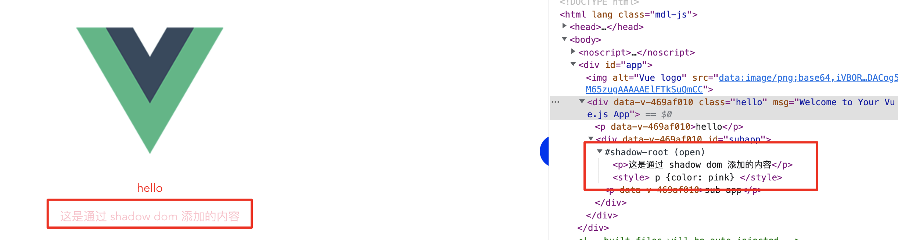

## 微前端运行原理
1. 监视路由变化
2. 匹配子应用
3. 加载子应用
4. 渲染子应用

<br>
<br>

## 路由劫持（SPA 监听路由, 如何实现的路由）
- `hash` 路由： `window.onhashchange`，通过事件监听
- `history` 路由
  - `window.onpopstate`: `history.go`、`history.back`、`history.forward`，通过事件监听
  - `pushState`、`replaceState` 需通过函数重写的方式进行劫持
- 获取上一个路由和当前打开的路由，方便后续的子应用的卸载
```js
import { handleRouter } from './handle-router'

let prevRoute = ''
let nextRoute = window.location.pathname

export const getPrevRoute = () => prevRoute
export const getNextRoute = () => nextRoute

export const rewriteRouter = () => {
  // history路由
  // 监听前进、后退、跳转
  window.addEventListener('popstate', () => {
    console.log('=== 监听前进、后退、跳转 ===')
    // popstate 触发的时候，路由已经完成导航了
    prevRoute = nextRoute
    nextRoute = window.location.pathname
    handleRouter()
  })

  // pushState 监听
  const rawPushState = window.history.pushState
  window.history.pushState = (...args) => {
    console.log('=== pushState 监听 ===')
    prevRoute = window.location.pathname
    rawPushState.apply(window.history, args)
    nextRoute = window.location.pathname
    handleRouter()
  }

  // replaceState 监听
  const rawReplaceState = window.history.replaceState
  window.history.replaceState = (...args) => {
    console.log('=== replaceState 监听 ===')
    prevRoute = window.location.pathname
    rawReplaceState.apply(window.history, args)
    nextRoute = window.location.pathname
    handleRouter()
  }
}
```

<br>
<br>

## 微应用加载
### 加载时机
- 初始执行匹配
页面刷新时，因没有监听到路由变化，所以页面丢失了，需要手动调用 `handleRouter`

- 路由跳转时执行匹配
路由跳转时执行 `rewriteRouter`, 即监听路由、渲染子应用 `handleRouter`
  ```js
  // main.js 中执行
  // 启动
  export function start() {
    // 路由劫持
    rewriteRouter()
    // 初始执行匹配
    handleRouter()
  }
  ```
<br>

### 初始执行匹配
#### 匹配子应用
获取到当前的路由路径，然后去子应用注册表中查找
```js
// handle-router.js
const apps = getApps()
// 匹配上一个子应用
const prevApp = apps.find(item => getPrevRoute().startsWith(item.activeRule))
// 匹配下一个子应用
const app = apps.find(item => getNextRoute().startsWith(item.activeRule))
```

#### 加载子应用
1. 卸载子应用
```js
// 加载前先卸载其他子应用
prevApp && unmount(prevApp)
// unmount
async function unmount(app) {
  const container = document.querySelector(app.container)
  app.unmount && (await app.unmount({
    container
  }))
  // 删除子应用除app外的其他节点，如script等
  container.innerHTML = ''
}
```
<br>

2. 配置环境变量
```js
// 判断是否从主应用中渲染子应用，为false时是单独加载子应用，为true时从主应用中加载
window.__POWERED_BY_QIANKUN__ = true
// 静态资源加载公共路径，后面详细说到
window.__INJECTED_PUBLIC_PATH_BY_QIANKUN__ = app.entry + '/'
```
<br>

3. 加载子应用的资源（`HTML`、`JS`）：解析 `HTML` 获取 `script` （参考第三方库 `import-html-entry`）
- template：`Dom` 节点
- getExternalScripts: 获取所有的 `script` 标签的代码：[代码,代码]
- execScripts: 获取并执行所有的 `script` 脚本代码
```js
// 加载html
const res = await axios.get(entry)
const template = document.createElement(`div`)
template.innerHTML = res.data

// 加载js
const getExternalScripts = () => {
  // 限定script查找范围，避免找到父节点的script标签
  const scripts = document.querySelectorAll(`${container} script`)
  return Promise.all(Array.from(scripts).map(item => {
    const src = item.getAttribute('src')
    if (src) {
      return axios.get(src.startsWith('http') ? src : entry + src)
    } else {
      return Promise.resolve(item.innerHTML)
    }
  }))
}
```
<br>
  
4. 渲染子应用（挂载）: 客户端渲染需要通过执行 `JS` 生成内容。浏览器出于安全考虑，`innerHTML` 中的 `script` 不会加载和执行,所以需要执行 `script` 代码
- 执行 `script`， `eval` 或 `new Function`,手动构造一个 `CommonJS` 模块环境，因为用 `window` 方式获取时每个子应用变量名称不同
```js
const execScripts = async () => {
  const res = await getExternalScripts()
  // 执行js代码前手动构造一个 commonjs 模块环境,之前子应用打包配置的umd格式
  const module = { exports: {} }
  const exports = module.exports
  res.forEach(item => eval(item?.data || item))
  // 获取生命周期，方便手动调用
  return module.exports
}
```
<br>
    
5. 切换子应用时销毁原子应用 `unmounted`, 获取子应用的生命周期钩子，并执行 `bootstrap`、 `mounted`
```js
// 渲染子应用,获取生命周期，手动渲染
const appCircle = await execScripts()
app.bootstrap = appCircle.bootstrap
app.mount = appCircle.mount
app.unmount = appCircle.unmount
bootstrap(app)
mount(app)

async function bootstrap(app) {
  app.bootstrap && (await app.bootstrap())
}
async function mount(app) {
  app.mount && (await app.mount({
    container: document.querySelector(app.container)
  }))
}
```
<br>

#### umd 打包结果分析
```js
(function (n, t) {
  // n: window
  // t: 子应用代码导出结果
  // CommonJS2 模块规范
  "object" === typeof exports && "object" === typeof module
    ? (module.exports = t())

    // 兼容 AMD 模块规范
    : "function" === typeof define && define.amd
    ? define([], t)

    // CommonJS
    : "object" === typeof exports
    ? (exports["subapp-app-123"] = t())

    // window[xxx] = t()
    : (n["subapp-app-123"] = t());
})(self, function () {});

```

<br>

#### 图片静态资源加载失败
- 问题
  - 主应用启动 `http://localhost:8081/`，子应用启动 `http://localhost:3000/`，子应用静态资源地址为 `http://localhost:3000/static/xxx`，用主应用启动访问的资源地址为 `http://localhost:8081/static/xxx`，一定会访问失败
- 解决
  - `webpack` 在运行时生成的路径会自动拼接上这个全局变量(如果有的话),即静态资源加载会带上这个变量, 即实际在主应用中访问的子应用资源地址为 `http://localhost:3000/static/xxx`
  - 新增 `public-path.js` 文件，用于修改运行时的 `publicPath`（通过它来指定应用程序中所有资源的基础路径）。什么是运行时的 [publicPath](https://webpack.docschina.org/guides/public-path/#on-the-fly) 
  - 注意点：在子应用入口文件中一定要放在最顶部！！！

```js
__webpack_public_path__ = 'xxxx'
```
```js
// public-path.js
if (window.__POWERED_BY_QIANKUN__) {
  // __INJECTED_PUBLIC_PATH_BY_QIANKUN__ 设置为子应用的 entry
  __webpack_public_path__ = window.__INJECTED_PUBLIC_PATH_BY_QIANKUN__
}
// main.js
import 'public-path.js'
```

<br>
<br>


## CSS 隔离
如果不进行样式隔离，子应用的样式会影响到主应用的样式
### 方式一： shadow dom
-  qiankun 中使用
```js
start({
  strictStyleIsolation: true // 使用shadow dom 解决样式冲突
})
```

-  原理
[详情](https://developer.mozilla.org/zh-CN/docs/Web/API/Element/attachShadow)
```html
<body>
  <p>hello</p>
  <!-- 子应用内容 -->
  <div id="subapp"></div>
  <script>
    const subApp = document.getElementById('subapp')
    // mode 指定 Shadow DOM 树封装模式的字符串
    // open 表示 shadow root 元素可以从 js 外部访问根节点
    // closed 表示拒绝从 js 外部访问关闭的 shadow root 节点
    const shadow = subApp.attachShadow({mode: 'open'})
    shadow.innerHTML = `
      <p>这是通过 shadow dom 添加的内容</p>
      <style>
        p {color: red}
      </style>
    `
  </script>
</body>
```

样例：


<br>
<br>

### 方式二： 选择器范围
-  qiankun 中使用
```js
start({
  experimentalStyleIsolation: true // 使用选择器范围来解决样式冲突
})
```
- 原理
给子应用所有样式放在 `data-qiankun="app-vue2"` 空间下,详见[从零开始写一个微前端框架-样式隔离篇](https://github.com/micro-zoe/micro-app/issues/20)
```js
div[data-qiankun="app-vue2"] #app[data-v-xxx] {
  color: red
}
```

<br>
<br>

### JS 沙箱
#### 问题
- 1、子应用向 `window` 上添加一个全局变量：*globalStr='child'*，如果此时基座应用也有一个相同的全局变量：*globalStr='parent'*，此时就产生了变量冲突，基座应用的变量会被覆盖。

- 2、子应用渲染后通过监听 `scroll` 添加了一个全局监听事件
  ```js
  window.addEventListener('scroll', () => {
    console.log('scroll')
  })
  ```
  当子应用被卸载时，监听函数却没有解除绑定，对页面滚动的监听一直存在。如果子应用二次渲染，监听函数会绑定两次，这显然是错误的。

<br>

#### 思路
- 1、创建代理，并在代理内增删改查想要的值，然后用 `with` 修改 `javascript` 执行的作用域
  ```js
  // /src/sandbox.js，增删改查
  export default class SandBox {
    active = false // 沙箱是否在运行
    microWindow = {} // // 代理的对象
    injectedKeys = new Set() // 新添加的属性，在卸载时清空

    constructor () {
      this.proxyWindow = new Proxy(this.microWindow, {
        // 取值
        get: (target, key) => {
          // 优先从代理对象上取值
          if (Reflect.has(target, key)) {
            return Reflect.get(target, key)
          }

          // 否则兜底到window对象上取值
          const rawValue = Reflect.get(window, key)

          // 如果兜底的值为函数，则需要绑定window对象，如：console、alert等
          if (typeof rawValue === 'function') {
            const valueStr = rawValue.toString()
            // 排除构造函数
            if (!/^function\s+[A-Z]/.test(valueStr) && !/^class\s+/.test(valueStr)) {
              return rawValue.bind(window)
            }
          }

          // 其它情况直接返回
          return rawValue
        },
        // 设置变量
        set: (target, key, value) => {
          // 沙箱只有在运行时可以在代理对象中设置变量
          if (this.active) {
            Reflect.set(target, key, value)

            // 记录添加的变量，用于后续清空操作
            this.injectedKeys.add(key)
          }

          return true
        },
        deleteProperty: (target, key) => {
          // 当前key存在于代理对象上时才满足删除条件
          if (target.hasOwnProperty(key)) {
            return Reflect.deleteProperty(target, key)
          }
          return true
        },
      })
    }

    ...
  }
  ```
  ```js
  // /src/sandbox.js
  export default class SandBox {
    ...
    // 启动
    start () {
      if (!this.active) {
        this.active = true
      }
    }

    // 停止
    stop () {
      if (this.active) {
        this.active = false
        // 清空变量
        this.injectedKeys.forEach((key) => {
          Reflect.deleteProperty(this.microWindow, key)
        })
        this.injectedKeys.clear()
      }
    }
  }
  ```
  ```js
  // 构造一个 with 来包裹需要执行的代码，返回 with 代码块的一个函数实例
  function withedYourCode(code) {
    code = 'with(globalObj) {' + code + '}'
    return new Function('globalObj', code)
  }
  ```

  使用沙箱,在 `src/app.js` 中引入沙箱，在 `CreateApp` 的构造函数中创建沙箱实例，并在 `mount` 方法中执行沙箱的 `start` 方法，在 `unmount` 方法中执行沙箱的 `stop` 方法。


  ```js
  // /src/app.js
  import loadHtml from './source'
  + import Sandbox from './sandbox'

  export default class CreateApp {
    constructor ({ name, url, container }) {
      ...
  +    this.sandbox = new Sandbox(name)
    }

    ...
    mount () {
      ...
  +    this.sandbox.start()
      // 执行js
      this.source.scripts.forEach((info) => {
        (0, eval)(info.code)
      })
    }

    /**
    * 卸载应用
    * @param destory 是否完全销毁，删除缓存资源
    */
    unmount (destory) {
      ...
  +    this.sandbox.stop()
      // destory为true，则删除应用
      if (destory) {
        appInstanceMap.delete(this.name)
      }
    }
  }
  ```
  
- 2、在沙箱中重写 `window.addEventListener` 和 `window.removeEventListener` ，记录所有全局监听事件，在应用卸载时如果有残余的全局监听事件则进行清空。在沙箱的**构造函数**中执行得到卸载的钩子函数 `releaseEffect`，在沙箱**关闭时**执行卸载操作，也就是在 `stop` 方法中执行 `releaseEffect` 函数
  ```js
  // /src/sandbox.js
  // 记录addEventListener、removeEventListener原生方法
  const rawWindowAddEventListener = window.addEventListener
  const rawWindowRemoveEventListener = window.removeEventListener

  /**
  * 重写全局事件的监听和解绑
  * @param microWindow 原型对象
  */
  function effect (microWindow) {
    // 使用Map记录全局事件
    const eventListenerMap = new Map()

    // 重写addEventListener
    microWindow.addEventListener = function (type, listener, options) {
      const listenerList = eventListenerMap.get(type)
      // 当前事件非第一次监听，则添加缓存
      if (listenerList) {
        listenerList.add(listener)
      } else {
        // 当前事件第一次监听，则初始化数据
        eventListenerMap.set(type, new Set([listener]))
      }
      // 执行原生监听函数
      return rawWindowAddEventListener.call(window, type, listener, options)
    }

    // 重写removeEventListener
    microWindow.removeEventListener = function (type, listener, options) {
      const listenerList = eventListenerMap.get(type)
      // 从缓存中删除监听函数
      if (listenerList?.size && listenerList.has(listener)) {
        listenerList.delete(listener)
      }
      // 执行原生解绑函数
      return rawWindowRemoveEventListener.call(window, type, listener, options)
    }

    // 清空残余事件
    return () => {
      console.log('需要卸载的全局事件', eventListenerMap)
      // 清空window绑定事件
      if (eventListenerMap.size) {
        // 将残余的没有解绑的函数依次解绑
        eventListenerMap.forEach((listenerList, type) => {
          if (listenerList.size) {
            for (const listener of listenerList) {
              rawWindowRemoveEventListener.call(window, type, listener)
            }
          }
        })
        eventListenerMap.clear()
      }
    }
  }
  ```

  ```js
  // 执行时机
  // /src/sandbox.js
  export default class SandBox {
    ...
    // 修改js作用域
    constructor () {
      // 卸载钩子
  +   this.releaseEffect = effect(this.microWindow)
      ...
    }

    stop () {
      if (this.active) {
        this.active = false

        // 清空变量
        this.injectedKeys.forEach((key) => {
          Reflect.deleteProperty(this.microWindow, key)
        })
        this.injectedKeys.clear()
        
        // 卸载全局事件
  +      this.releaseEffect()
      }
    }
  }
  ```


#### 具体
- 快照沙箱
- javascript 沙箱

### 状态管理

### 应用通信


<br>

## 相关材料
- [视频教程-手写qiankun微前端框架](https://www.bilibili.com/video/BV1H34y117fe/?spm_id_from=333.337.search-card.all.click&vd_source=65105152fda76ce4f74f171879bbdcac)
- [手写微前端 simple-qiankun](https://juejin.cn/post/7079379620348313637)
- [从零开始写一个微前端框架-沙箱篇](https://github.com/micro-zoe/micro-app/issues/19)
- [浅析 JavaScript 沙箱机制](https://zhuanlan.zhihu.com/p/428039764)
- [说说微前端JS沙箱实现的几种方式](https://juejin.cn/post/6981374562877308936)


